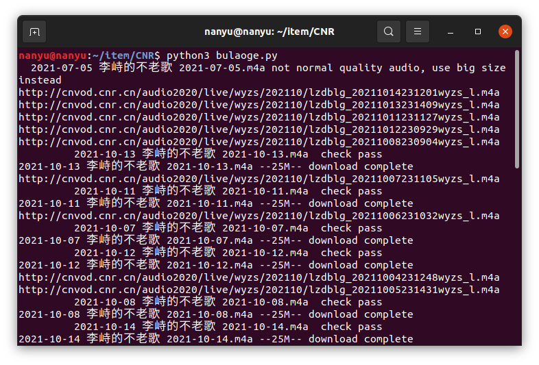

### Chinese National Radio(央广网) web scraper

	In order to download LiZhiFM( **李峙的不老歌** )(one of the most popular Chinese radios), We wrote the program. In face, you could download every radio which have resided there.

### Features

- support search radio 
- Download all radio or limited range
- Multiple thread downloading
- Skip files which have downloaded
- Auto tidy radio files after downloading complete

### Use
#### Install prerequisite

`pip install -r requirement.txt`
#### Run
`python3 bulaoge.py`

